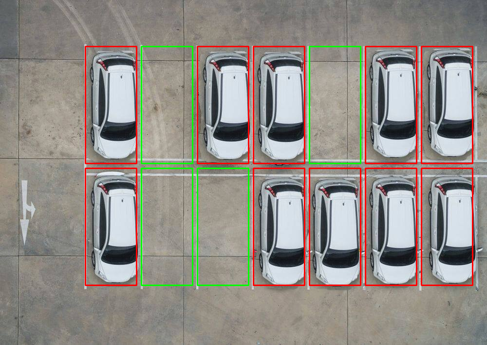

# Avacancy

Real time representation of Parking availability

## Inspiration
Driving around a parking lot and cruising every little corner only to find out that it is completely filled can be very frustrating. So we decided to tackle this problem in our own little way

## What it does
The program makes use of existing security cameras in parking lots and detects for cars. From there, we display the data in a format that is consistent with the layout of the parking lot, but with occupied spaces filled red, vacant spaces filled green

## How we built it
We wrote the entire program in python.
1. Used opencv to operate the camera and take a picture of the parking lot (printed) every 5 seconds to detect for vacancy. This demonstrates how our program could integrate with the existing cameras
2. We also took a clip of a real-world parking lot, and also took a frame every 5 seconds to detect vacancy. This shows the performance of our program in a real-world situation. 
3. Applied matrix transformation to the selected frame to straighten it
4. Use a colour based algorithm to distinguish cars from the ground 

## Challenges we ran into
1. We tried to use Google Vision to detect the cars, however, the API had trouble with detecting cars from an elevated view.
2. We also tried to use Clarifai API, however, it had the same problem. 
3. We formed a team at the team-forming event, decided on an idea, split our responsibilities, however, Saturday morning, the other 2 members already began working on another project, and at the same time, our project was around halfway done. Our goals differed too much so we decided to work as teams of 2s

## Accomplishments that we're proud of
As a 2 man team, we are proud of pulling ourselves together after a critical situation and managing to put together a working model that isn't too far from what we planned

## What we learned
We learned a lot about python, especially the library opencv. 
Also, even though it did not end up working for us, but through experimenting with Google Vision API and Clarifai API, we learned the in's and out's of the APIs and learned what kind of situations call for the use of them

## What's next for Avacancy
We see a lot of potential in the future for Avacancy, we plan to incorporate an algorithm that maximizes the efficiency by leading drivers to their space. 
Also, we think that Avacancy can be generalized to many many things such as library study rooms, laundry rooms, even washroom stalls! In the future, we plan to create an Avancancy app that includes a family of possible generalizations and push one step further in the direction of a true Smart City.